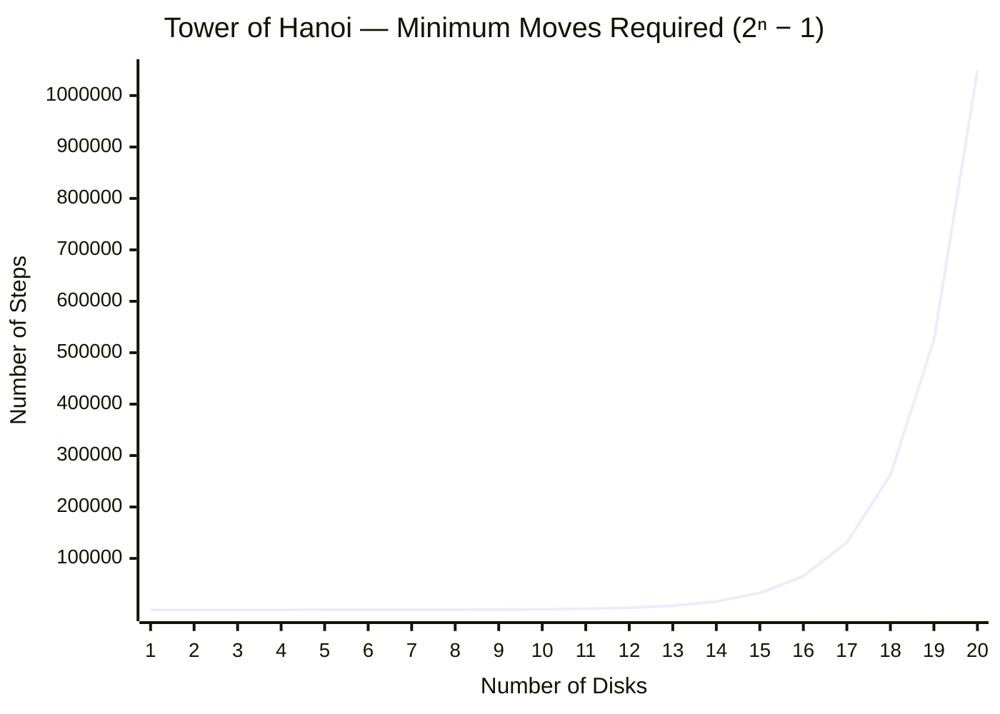

# Tower of Hanoi — Animated Visualizer

A premium, browser-based Tower of Hanoi solver with smooth step-by-step animation, adjustable speed, and a modern glassmorphism UI. No frameworks — pure vanilla JS, CSS, and HTML, bundled with Vite.

## Features

- **Animated solver** — watches each disk move in real time using the FLIP animation technique
- **1–12 disks** — disk sizes and heights scale dynamically to fit the stage
- **Speed control** — 1×, 2×, 3×, 5×, and 10× playback speeds
- **Live move counter** — tracks current move vs. total moves required
- **High-disk warning** — alerts you when move count will be very large (> 8 disks)
- **Glassmorphism UI** — dark theme with gradient-coloured disks and backdrop blur

## Tech Stack

| Layer | Tool |
|---|---|
| Bundler | Vite 8 |
| Language | Vanilla JavaScript (ES Modules) |
| Styling | CSS custom properties |
| Fonts | Google Fonts — Outfit |

## Getting Started

```bash
npm install
npm run dev      # development server at localhost:5173
npm run build    # production build → dist/
npm run preview  # preview the production build
```

## How It Works

The recursive algorithm pre-computes every move before animation begins:

```js
function solve(n, source, target, aux) {
  if (n === 0) return;
  solve(n - 1, source, aux, target);   // move n-1 disks out of the way
  result.push({ disk: n, from: source, to: target });
  solve(n - 1, aux, target, source);   // stack them on top
}
```

Each disk is then animated using the **FLIP technique** — snapshot position before DOM move, apply an inverse `transform`, then release to let CSS transitions carry it smoothly to the destination.

## Moves Required by Disk Count

The minimum number of moves to solve the puzzle is **2ⁿ − 1**, which grows exponentially.



| Disks | Moves Required |
|------:|---------------:|
| 1 | 1 |
| 2 | 3 |
| 3 | 7 |
| 4 | 15 |
| 5 | 31 |
| 6 | 63 |
| 7 | 127 |
| 8 | 255 |
| 9 | 511 |
| 10 | 1,023 |
| 11 | 2,047 |
| 12 | 4,095 |
| 13 | 8,191 |
| 14 | 16,383 |
| 15 | 32,767 |
| 16 | 65,535 |
| 17 | 131,071 |
| 18 | 262,143 |
| 19 | 524,287 |
| 20 | 1,048,575 |

> The visualizer caps at 12 disks (4,095 moves). Beyond that, animation becomes impractical at any speed.

## License

MIT
